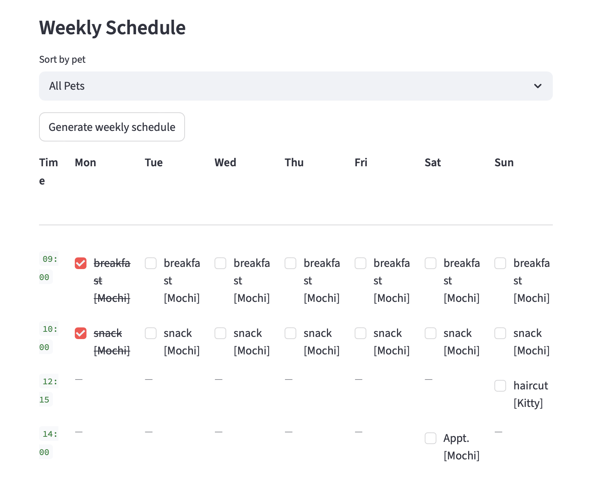
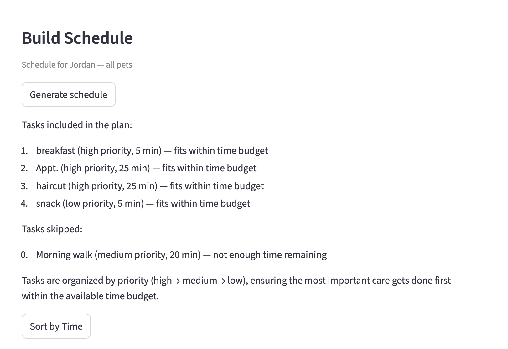
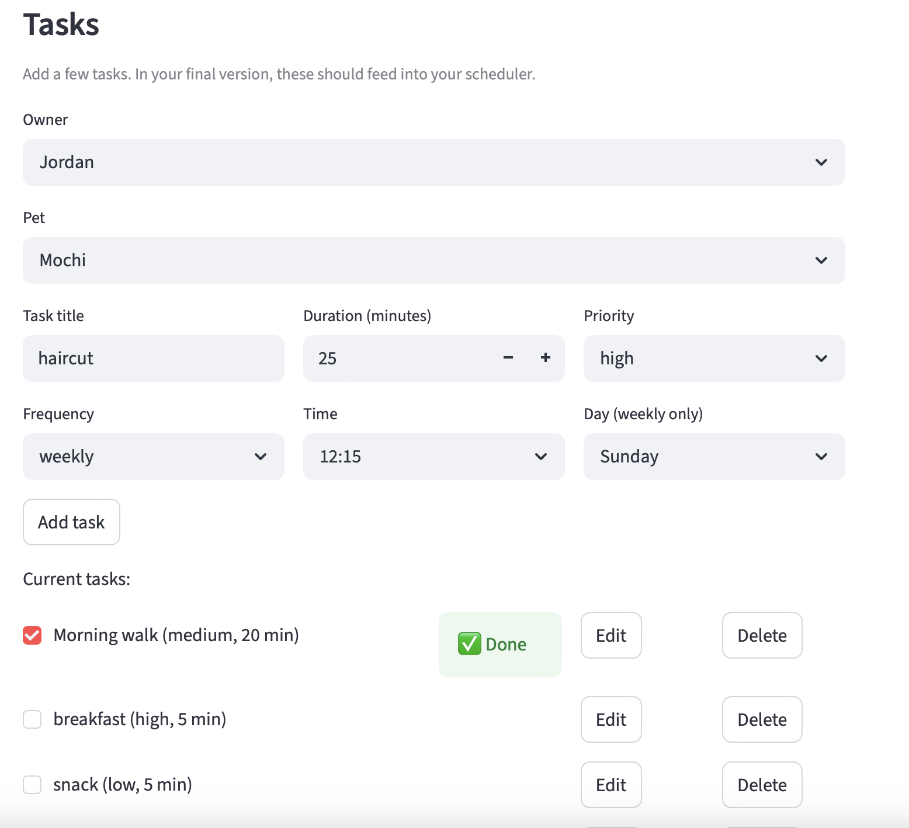
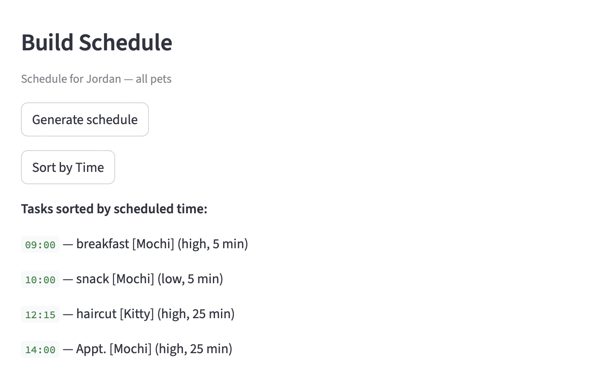
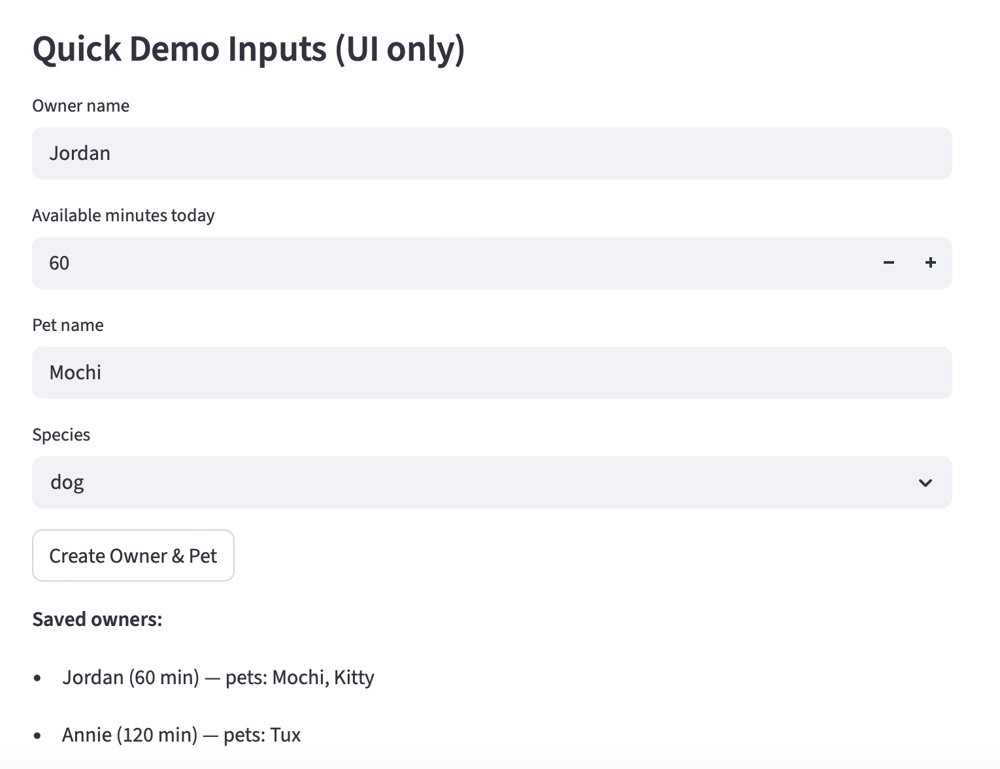

# PawPal+ — AI-Powered Pet Care Scheduler

> A smart pet care planning app that turns plain-English task descriptions into a prioritized, conflict-free weekly schedule — powered by a lightweight RAG pipeline.

---

## Original Project (Modules 1–3)

**PawPal+** began as a rule-based pet care scheduling app built in Modules 1–3. The original goal was to help busy pet owners stay on top of daily care tasks by letting them log tasks for each of their pets, set priorities and durations, and generate a daily plan that fits within their available time. The app supported conflict detection, recurring tasks, and a visual weekly calendar — all driven by hand-coded scheduling logic and a Streamlit UI. Module 4 extended this foundation by integrating a Retrieval-Augmented Generation (RAG) pipeline that allows users to describe tasks in plain English, which the system then parses, classifies, and converts into structured `Task` objects automatically.

---

## What PawPal+ Does and Why It Matters

Managing care for one or more pets means tracking dozens of recurring tasks — medications that can't be skipped, walks that need to happen at specific times, grooming appointments, vet visits, and training sessions. Keeping all of this organized in a way that respects priorities and avoids scheduling conflicts is genuinely hard to do in a spreadsheet or a notes app.

PawPal+ solves this by letting owners describe their pet care tasks the way they'd say them out loud — "Give Luna her medication at 8am" or "Walk Max after breakfast" — and then automatically:

- Extracts the task name, priority, duration, category, and scheduled time
- Flags conflicts when two tasks overlap on the same day
- Builds a prioritized daily or weekly plan that respects what's non-negotiable vs. what can flex
- Explains the scheduling decisions so the owner understands why tasks were included or deferred

This matters because pet care failures (missed medications, skipped meals) have real consequences. A system that makes planning effortless — and warns you when something is wrong — helps owners be more consistent.

---

## Architecture Overview

```
┌─────────────────────────────────────────────────────┐
│                  Streamlit UI (app.py)               │
│  ┌──────────────┐  ┌──────────────┐  ┌───────────┐  │
│  │ Smart Input  │  │ Manual Form  │  │ Calendar  │  │
│  │ (plain text) │  │ (structured) │  │ (weekly)  │  │
│  └──────┬───────┘  └──────┬───────┘  └─────▲─────┘  │
└─────────┼────────────────-┼────────────────┼─────────┘
          │                 │                │
          ▼                 │                │
┌─────────────────────┐     │                │
│   RAG Pipeline      │     │                │
│   (rag_helper.py)   │     │                │
│                     │     │                │
│  1. Load KB         │     │                │
│  2. Parse input     │     │                │
│  3. Retrieve context│     │                │
│  4. Classify task   │     │                │
│  5. Build Task objs │     │                │
└──────────┬──────────┘     │                │
           │                │                │
           ▼                ▼                │
┌──────────────────────────────────────┐     │
│        Core Domain (pawpal_system.py)│     │
│  Task · Pet · Owner · Scheduler      │─────┘
│                                      │
│  generate_plan() → priority sort     │
│  detect_conflicts() → overlap flags  │
│  generate_weekly_schedule() → Mon-Sun│
│  explain_plan() → human-readable why │
└──────────────────────────────────────┘
           │
           ▼
   knowledge_base.md
   (33 domain rules for
    priorities, durations,
    and time defaults)
```

**Data flow for Smart Input:** The user types one or more tasks in plain English → the RAG pipeline tokenizes the input and retrieves only the relevant lines from `knowledge_base.md` (e.g., medication rules for "give Luna her pills") → a rule-based classifier uses the retrieved context to assign priority, duration, category, and scheduled time → structured `Task` objects are added to the appropriate pet → the Scheduler sorts, validates, and renders the plan.

**No external API calls.** The RAG layer uses keyword-based retrieval against a local markdown knowledge base, making the system fast, free to run, and deterministic.

---

## Setup Instructions

### Prerequisites

- Python 3.9 or higher
- `pip` (comes with Python)

### Steps

```bash
# 1. Clone the repository
git clone https://github.com/malhiya/pawpal-applied-ai.git
cd pawpal-applied-ai

# 2. Create and activate a virtual environment
python3 -m venv .venv
source .venv/bin/activate        # macOS / Linux
# .venv\Scripts\activate         # Windows

# 3. Install dependencies
pip install -r requirements.txt

# 4. Launch the app
streamlit run app.py
```

The app will open automatically at `http://localhost:8501`.

### Run the test suite

```bash
python -m pytest tests/test_pawpal.py -v
```

---

## Sample Interactions

### Example 1 — Smart Task Parsing (RAG Pipeline)

**User types into the Smart Task Input box:**

```
Give Luna her medication at 8am
Walk Max after breakfast
Schedule grooming next Saturday
Play session in the afternoon
```

**System output (parsed tasks added automatically):**

| Task | Priority | Duration | Scheduled Time | Category |
|------|----------|----------|----------------|----------|
| Give Luna her medication | Non-negotiable | 5 min | 08:00 | Medication |
| Walk Max | High | 30 min | 08:30 | Walk |
| Grooming | Medium | 20 min | (next Saturday only) | Grooming |
| Play session | Low | 20 min | 14:00 | Play |

The RAG pipeline detects "medication" → retrieves the medication priority rule from the knowledge base → classifies as non-negotiable. "After breakfast" maps to the 08:30 time default. "Next Saturday" is recognized as a one-time event rather than a recurring task.

---

### Example 2 — Building and Explaining a Schedule

**User clicks "Build Schedule" with 90 minutes available.**

**System output:**

```
Your plan for today:

1. [NON-NEGOTIABLE] Give Luna her medication — 5 min @ 08:00
2. [HIGH] Walk Max — 30 min @ 08:30
3. [MEDIUM] Grooming — 20 min (unscheduled)
4. [LOW] Play session — 20 min @ 14:00

Time used: 75 min / 90 min available

Explanation:
✓ Medication included — non-negotiable, always scheduled first.
✓ Walk Max included — high priority, fits within available time.
✓ Grooming included — medium priority, fits within remaining time.
✓ Play session included — low priority, fits within remaining time.
```

---

### Example 3 — Conflict Detection

**User adds two tasks that overlap:**
- "Vet appointment at 10:00am" (60 min)
- "Grooming at 10:00am" (20 min)

**System output (warning displayed in UI):**

```
⚠ Conflict detected:
  • "Vet appointment" and "Grooming" are both scheduled at 10:00 on the same day.
  Please adjust one of these tasks to resolve the overlap.
```

The conflict is surfaced immediately in the weekly calendar view with a warning banner, giving the owner the chance to reschedule before the day begins.

---

## Design Decisions

### 1. Lightweight RAG over an LLM API

**Decision:** The RAG pipeline uses keyword-based retrieval against a local markdown knowledge base instead of calling an LLM (e.g., GPT-4 or Claude).

**Why:** Pet care task classification is a well-scoped problem with a small, enumerable domain. A knowledge base of 33 rules captures everything that matters — medication priority, duration defaults, time-of-day mappings — without the latency, cost, or unpredictability of an API call. The rule-based classifier on top of retrieved context is fully deterministic, easy to debug, and requires zero credentials to run.

**Trade-off:** The system can't handle truly ambiguous or novel phrasing. "Do the thing Luna needs in the morning" won't parse as a medication task. An LLM would handle this gracefully; the keyword retriever won't. For the current scope this is acceptable — the manual form is always available as a fallback.

### 2. In-Memory State (No Database)

**Decision:** All owner, pet, and task data lives in Streamlit's `session_state`. Nothing is persisted to disk.

**Why:** Avoiding a database removes an entire class of infrastructure complexity — no schema migrations, no connection management, no data serialization bugs. For a portfolio project and early-stage MVP this is the right call; it lets the scheduling logic and RAG pipeline stay front and center.

**Trade-off:** Data is lost on page refresh. A real production version would need at least local JSON persistence or a lightweight SQLite store. This is a known and intentional gap, not an oversight.

### 3. Priority as an Ordered Enum

**Decision:** Tasks are classified into four tiers — `non-negotiable`, `high`, `medium`, `low` — rather than a numeric score.

**Why:** Named tiers map directly to how pet owners actually think about their tasks. "Medication" is categorically different from "play session" — not just numerically lower. Named tiers also make the plan explanation human-readable without translation.

**Trade-off:** Within a tier, there's no further ordering. Two `high` priority tasks are treated as equal and ordered by insertion. A numeric score (0–100) would give finer control but would require more calibration work and make explanations harder to read.

### 4. Streamlit as the UI Framework

**Decision:** The entire frontend is built in Streamlit rather than Flask + HTML/CSS or a React frontend.

**Why:** Streamlit lets Python code drive the UI directly, which means the domain logic and the UI stay in the same language and the same mental model. For a scheduling app where state transitions (add task → rebuild schedule → update calendar) are the core interaction loop, Streamlit's reactive rerun model is a natural fit.

**Trade-off:** Streamlit's component model is less flexible than a custom frontend. Modal dialogs require workarounds, and advanced calendar interactions (drag-to-reschedule, inline editing) are difficult or impossible. The `streamlit-calendar` widget covers the use cases needed here, but a production version with richer UX would likely need a dedicated frontend.

### 5. Human Review Over Auto-Resolution

**Decision:** When the system detects a conflict or is uncertain about a classification, it flags it for the user rather than silently resolving it.

**Why:** Pet care mistakes have real consequences. A system that silently drops a medication task to resolve a conflict is worse than one that asks the owner to decide. Surfacing ambiguity keeps the human in the loop on decisions that matter.

**Trade-off:** More friction for the user in the happy path. An owner managing a large task list may find repeated conflict warnings annoying. Future work could add smarter auto-resolution (e.g., suggest the next available time slot) while still requiring confirmation for non-negotiable tasks.

---

## Testing Summary

The test suite validated the core scheduling and RAG pipeline logic, confirming that tasks are correctly parsed, prioritized, and conflict-detected across a range of inputs. Priority classification and conflict detection worked reliably for well-formed inputs, and the RAG retrieval accurately matched keyword-rich phrases like "medication" and "walk" to the correct knowledge base rules. The main limitation uncovered was the keyword retriever's inability to handle ambiguous or unconventional phrasing — inputs like "do Luna's morning thing" produced no match, confirming the trade-off documented in the design decisions. This reinforced that the manual input form is a necessary fallback and that an LLM-backed parser would be needed to handle open-ended natural language robustly.

---

## Reflection

*Coming soon.*

---

## Screenshots

| Weekly Calendar | Build Schedule | Task List |
|----------------|---------------|-----------|
|  |  |  |

| Sort by Time | Owner & Pet Setup |
|-------------|-------------------|
|  |  |
