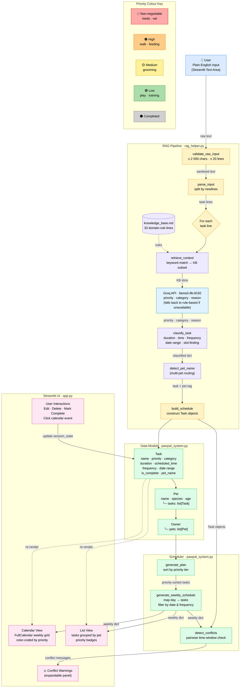

```mermaid
flowchart TD
    %% ─── Entry Point ───────────────────────────────────────────────────────────
    USER["🐾 User\nPlain-English Input\n(Streamlit Text Area)"]

    %% ─── RAG Pipeline ──────────────────────────────────────────────────────────
    subgraph RAG["RAG Pipeline · rag_helper.py"]
        direction TB
        V["validate_raw_input\n≤ 2 000 chars · ≤ 20 lines"]
        KB[("knowledge_base.md\n33 domain-rule lines")]
        PARSE["parse_input\nsplit by newlines"]
        LOOP{"For each\ntask line"}
        RET["retrieve_context\nkeyword match → KB subset"]
        GROQ["Groq API · llama3-8b-8192\npriority · category · reason\n(falls back to rule-based if unavailable)"]
        CLS["classify_task\nduration · time · frequency\ndate range · slot-finding"]
        PET["detect_pet_name\n(multi-pet routing)"]
        BUILD["build_schedule\nconstruct Task objects"]
    end

    %% ─── Data Models ───────────────────────────────────────────────────────────
    subgraph MODELS["Data Models · pawpal_system.py"]
        direction TB
        OWNER["Owner\n└─ pets: list[Pet]"]
        PET_OBJ["Pet\nname · species · age\n└─ tasks: list[Task]"]
        TASK_OBJ["Task\nname · priority · category\nduration · scheduled_time\nfrequency · date range\nis_complete · pet_name"]
    end

    %% ─── Scheduler ─────────────────────────────────────────────────────────────
    subgraph SCHED["Scheduler · pawpal_system.py"]
        direction TB
        PLAN["generate_plan\nsort by priority tier"]
        WEEKLY["generate_weekly_schedule\nmap day → tasks\nfilter by date & frequency"]
        CONFLICT_S["detect_conflicts\npairwise time-window check"]
    end

    %% ─── Streamlit UI ──────────────────────────────────────────────────────────
    subgraph UI["Streamlit UI · app.py"]
        direction TB
        CONFLICT_UI["⚠️ Conflict Warnings\n(expandable panel)"]
        LIST_VIEW["List View\ntasks grouped by pet\npriority badges"]
        CAL_VIEW["Calendar View\nFullCalendar weekly grid\ncolor-coded by priority"]
        ACTIONS["User Interactions\nEdit · Delete · Mark Complete\nClick calendar event"]
    end

    %% ─── Connections ───────────────────────────────────────────────────────────
    USER -->|raw text| V
    V -->|sanitised text| PARSE
    KB -.->|rules| RET
    PARSE -->|task lines| LOOP
    LOOP --> RET
    RET -->|KB slice| GROQ
    GROQ -->|priority · category · reason| CLS
    CLS -->|classified dict| PET
    PET -->|task + pet tag| BUILD
    BUILD -->|Task objects| CONFLICT_S

    BUILD --> TASK_OBJ
    TASK_OBJ --> PET_OBJ
    PET_OBJ --> OWNER
    OWNER --> PLAN

    PLAN -->|priority-sorted tasks| WEEKLY
    WEEKLY -->|weekly dict| CONFLICT_S
    CONFLICT_S -->|conflict messages| CONFLICT_UI
    WEEKLY -->|weekly dict| LIST_VIEW
    WEEKLY -->|weekly dict| CAL_VIEW

    ACTIONS -->|update session_state| TASK_OBJ
    TASK_OBJ -.->|re-render| LIST_VIEW
    TASK_OBJ -.->|re-render| CAL_VIEW

    %% ─── Priority colour legend ─────────────────────────────────────────────────
    subgraph LEGEND["Priority Colour Key"]
        direction LR
        L1["🔴 Non-negotiable\nmeds · vet"]
        L2["🟠 High\nwalk · feeding"]
        L3["🟡 Medium\ngrooming"]
        L4["🟢 Low\nplay · training"]
        L5["⚫ Completed"]
    end

    %% ─── Styles ─────────────────────────────────────────────────────────────────
    style USER        fill:#dbeafe,stroke:#3b82f6,color:#000
    style V           fill:#fef3c7,stroke:#f59e0b,color:#000
    style KB          fill:#ede9fe,stroke:#8b5cf6,color:#000
    style PARSE       fill:#fef3c7,stroke:#f59e0b,color:#000
    style LOOP        fill:#fef3c7,stroke:#f59e0b,color:#000
    style RET         fill:#ede9fe,stroke:#8b5cf6,color:#000
    style GROQ        fill:#e0f2fe,stroke:#0284c7,color:#000
    style CLS         fill:#ede9fe,stroke:#8b5cf6,color:#000
    style PET         fill:#ede9fe,stroke:#8b5cf6,color:#000
    style BUILD       fill:#fef3c7,stroke:#f59e0b,color:#000
    style OWNER       fill:#dcfce7,stroke:#22c55e,color:#000
    style PET_OBJ     fill:#dcfce7,stroke:#22c55e,color:#000
    style TASK_OBJ    fill:#dcfce7,stroke:#22c55e,color:#000
    style PLAN        fill:#dcfce7,stroke:#22c55e,color:#000
    style WEEKLY      fill:#dcfce7,stroke:#22c55e,color:#000
    style CONFLICT_S  fill:#dcfce7,stroke:#22c55e,color:#000
    style CONFLICT_UI fill:#fce7f3,stroke:#ec4899,color:#000
    style LIST_VIEW   fill:#fce7f3,stroke:#ec4899,color:#000
    style CAL_VIEW    fill:#fce7f3,stroke:#ec4899,color:#000
    style ACTIONS     fill:#fce7f3,stroke:#ec4899,color:#000
    style L1          fill:#ffaaaa,stroke:#cc0000,color:#000
    style L2          fill:#ffcc88,stroke:#e67e00,color:#000
    style L3          fill:#fff099,stroke:#ccaa00,color:#000
    style L4          fill:#aaddaa,stroke:#228822,color:#000
    style L5          fill:#d0d0d0,stroke:#666666,color:#000
```
