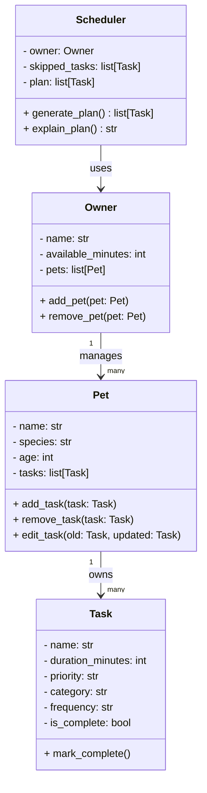

# PawPal+ UML Design

## Class Diagram (Mermaid)



## Class Diagram (ASCII)

```
┌─────────────────────────────┐
│            Task             │
│  A single pet care activity │
├─────────────────────────────┤
│ - name: str                 │
│ - duration_minutes: int     │
│ - priority: str             │
│   (high / medium / low)     │
│ - category: str             │
│ - frequency: str            │
│   (daily, weekly, etc.)     │
│ - is_complete: bool         │
├─────────────────────────────┤
│ + mark_complete()           │
└─────────────────────────────┘
          △ owns many
          │
┌─────────────────────────────┐
│            Pet              │
│  Stores pet details and     │
│  its list of care tasks     │
├─────────────────────────────┤
│ - name: str                 │
│ - species: str              │
│ - age: int                  │
│ - tasks: list[Task]         │
├─────────────────────────────┤
│ + add_task(task: Task)      │
│ + remove_task(task: Task)   │
│ + edit_task(old: Task,      │
│     updated: Task)          │
└─────────────────────────────┘
          △ manages many
          │
┌─────────────────────────────┐
│           Owner             │
│  Manages multiple pets and  │
│  provides access to all     │
│  their tasks                │
├─────────────────────────────┤
│ - name: str                 │
│ - available_minutes: int    │
│ - pets: list[Pet]           │
├─────────────────────────────┤
│ + add_pet(pet: Pet)         │
│ + remove_pet(pet: Pet)      │
└─────────────────────────────┘
          │ passed into
          ▼
┌─────────────────────────────┐
│         Scheduler           │
│  Retrieves, organizes, and  │
│  manages tasks across all   │
│  of the owner's pets        │
├─────────────────────────────┤
│ - owner: Owner              │
│ - skipped_tasks: list[Task] │
│ - plan: list[Task]          │
├─────────────────────────────┤
│ + generate_plan(): list     │
│   [Task]                    │
│ + explain_plan(): str       │
└─────────────────────────────┘
```

## Relationships

- **Pet owns many Tasks** — each pet carries its own task list (walks, meds, feeding, etc.)
- **Owner manages many Pets** — one owner can have multiple pets
- **Scheduler uses Owner** — aggregates tasks from all `owner.pets` to build and explain the plan

## Scheduling Logic (generate_plan)

1. Collect all tasks from every pet in `owner.pets`
2. Filter out already-complete tasks (`is_complete == True`)
3. Sort remaining tasks by priority (high → medium → low)
4. Greedily add tasks until `available_minutes` is exhausted
5. Store tasks that didn't fit in `skipped_tasks`
6. Return the selected tasks as an ordered list

## Explanation Logic (explain_plan)

- For each task in the plan, state why it was included (priority + duration fit)
- For each task in `skipped_tasks`, state why it was excluded (e.g., "not enough time remaining")
- Returns a human-readable string suitable for display in the UI
