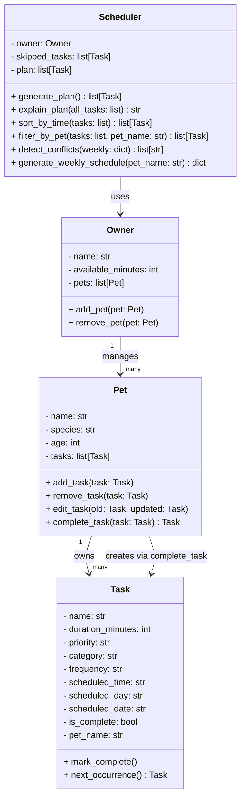

# PawPal+ UML Design

## Class Diagram (Mermaid)



## Class Diagram (ASCII)

```
┌──────────────────────────────┐
│             Task             │
│  A single pet care activity  │
├──────────────────────────────┤
│ - name: str                  │
│ - duration_minutes: int      │
│ - priority: str              │
│   (high / medium / low)      │
│ - category: str              │
│ - frequency: str             │
│   (daily / weekly)           │
│ - scheduled_time: str        │
│   e.g. "08:00"               │
│ - scheduled_day: str         │
│   e.g. "Monday"              │
│ - scheduled_date: str        │
│   e.g. "2026-03-30"          │
│ - is_complete: bool          │
│ - pet_name: str              │
├──────────────────────────────┤
│ + mark_complete()            │
│ + next_occurrence() -> Task  │
└──────────────────────────────┘
          △ owns many
          │
┌──────────────────────────────┐
│             Pet              │
│  Stores pet details and      │
│  manages its list of tasks   │
├──────────────────────────────┤
│ - name: str                  │
│ - species: str               │
│ - age: int                   │
│ - tasks: list[Task]          │
├──────────────────────────────┤
│ + add_task(task: Task)       │
│ + remove_task(task: Task)    │
│ + edit_task(old, updated)    │
│ + complete_task(task) ->Task │
└──────────────────────────────┘
          △ manages many
          │
┌──────────────────────────────┐
│            Owner             │
│  Manages multiple pets and   │
│  defines the time budget     │
├──────────────────────────────┤
│ - name: str                  │
│ - available_minutes: int     │
│ - pets: list[Pet]            │
├──────────────────────────────┤
│ + add_pet(pet: Pet)          │
│ + remove_pet(pet: Pet)       │
└──────────────────────────────┘
          │ passed into
          ▼
┌──────────────────────────────┐
│          Scheduler           │
│  Retrieves, organizes, and   │
│  manages tasks across all    │
│  of the owner's pets         │
├──────────────────────────────┤
│ - owner: Owner               │
│ - skipped_tasks: list[Task]  │
│ - plan: list[Task]           │
├──────────────────────────────┤
│ + generate_plan()            │
│ + explain_plan(all_tasks)    │
│ + sort_by_time(tasks)        │
│ + filter_by_pet(tasks, name) │
│ + detect_conflicts(weekly)   │
│ + generate_weekly_schedule() │
└──────────────────────────────┘
```

## Relationships

- **Pet owns many Tasks** — each pet carries its own task list; tasks store `pet_name` as a back-reference
- **Owner manages many Pets** — one owner can have multiple pets
- **Scheduler uses Owner** — aggregates tasks from all `owner.pets` to build, filter, sort, and explain the plan
- **Pet creates Tasks via complete_task** — marking a task complete automatically schedules its next occurrence

## Scheduling Logic (generate_plan)

1. Collect all tasks from every pet in `owner.pets`
2. Filter out already-complete tasks (`is_complete == True`)
3. Sort remaining tasks by priority (high → medium → low)
4. Greedily add tasks until `available_minutes` is exhausted
5. Store tasks that didn't fit in `skipped_tasks`
6. Return the selected tasks as an ordered list

## Smarter Scheduling Methods

- **`sort_by_time`** — sorts any task list by `scheduled_time` ascending
- **`filter_by_pet`** — narrows a task list to a single pet (or returns all for "All Pets")
- **`detect_conflicts`** — flags two tasks sharing the same `scheduled_time` on the same day
- **`generate_weekly_schedule`** — maps each day of the week to its sorted tasks; daily tasks appear every day, weekly tasks appear on their `scheduled_day`

## Explanation Logic (explain_plan)

- Takes `all_tasks` to resolve task indices for display
- For each task in the plan, states why it was included (priority + duration fit)
- For each task in `skipped_tasks`, states why it was excluded (not enough time remaining)
- Returns a human-readable string suitable for display in the UI
